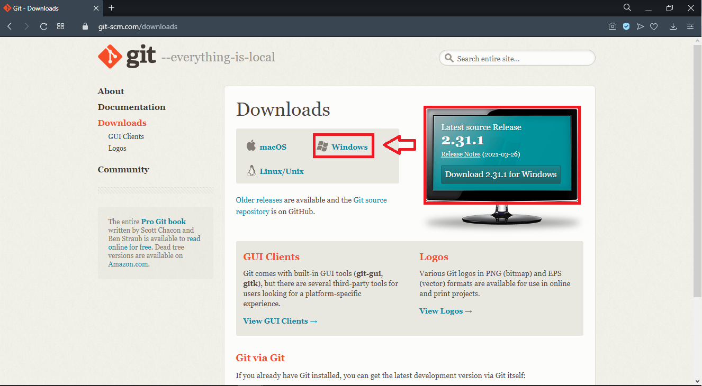

## YOLO-DARKNET İLE MARUL TESPİTİ

Yolo algoritması kullanılarak nesne tespit işlemi gerçekleştirilecek. Tüm işlemler 
sırasıyla aşağıda adımlar halinde gösterilmiştir.

### ADIM-1: "Git Bash" Kurulumu

Git Bash sayesinde Github üzerinde bulunan klasörleri bilgisayarımıza indirebilmekteyiz.
Git Bash’i indirebilmek için aşağıda verilen adrese gidilir.

https://git-scm.com/downloads 

Bu adresteki sistem sizin bilgisayarınızda hangi işletim sistemi bulunduğunu otomatik olarak
algılayacaktır. Bilgisayarınızda bulunan işletim sistemine tıklanır ve indirme işlemine başlanır.

Yapay zeka alanına giriş yapmak ve "öğrenen" uygulamalar geliştirmek istiyorsanız derin öğrenme 
yöntemlerini öğrenmek için Udemy üzerinde açtığım kursu takip edebilirsiniz. "Derin Öğrenmeye Giriş" kursu temelden ileri seviyeye kadar teorik anlatım ve pratik uygulamaları içermektedir. Bu dersi bitirdiğinizde, derin öğrenmenin temellerini, yapay sinir ağı modelleri oluşturma ve geliştirme adımlarını ve başarılı yapay öğrenme projelerini nasıl gerçekleştirebileceğinizi öğreneceksiniz.

