## YOLO-DARKNET İLE MARUL TESPİTİ

Yolo algoritması kullanılarak nesne tespit işlemi gerçekleştirilecek. Tüm işlemler 
sırasıyla aşağıda adımlar halinde gösterilmiştir.

### ADIM-1: "Git Bash" Kurulumu

Git Bash sayesinde Github üzerinde bulunan klasörleri bilgisayarımıza indirebilmekteyiz.
Git Bash’i indirebilmek için aşağıda verilen adrese gidilir.

https://git-scm.com/downloads 

Bu adresteki sistem sizin bilgisayarınızda hangi işletim sistemi bulunduğunu otomatik olarak
algılayacaktır. Bilgisayarınızda bulunan işletim sistemine tıklanır ve indirme işlemine başlanır.

Setup dosyası bilgisayara indikten sonra tüm adımlara Next diyerek kurulum tamamlanır.

### ADIM-2: Darknet Kurulumu

Öncelikle çalışmalarımızı yapacağımız bir klasör oluşturmamız gerekiyor. Ben D’nin altına DeepLearningProjects
isminde bir klasör oluşturdum bu klasör içerisine de LettuceDetection isminde bir klasör daha oluşturdum. 
Tüm çalışmalarımızı ve darknet’i bu klasör içerisine kuracağım. Çalışmamda marul resimlerinin bulunduğu veri
setini kullanarak marul tespiti yapacağım için LettuceDetection ismini koydum. 

Daha sonra oluşturulan LettuceDetection klasörü içerisine girilir ve mause ile sağ tıklanarak “Git Bash Here”
seçeneği seçilir ve git komut satırı açılır.

Ardından aşağıdaki şekilde gösterilen Git Bash açılır.

Git Bash açıldıktan sonra Darknet klasörlerinin bulunduğu github hesabına gitmek için aşağıdaki github adresine
gidilir. 

https://github.com/AlexeyAB/darknet 

Bu adreste yolov4 modelini eğitebilmemiz için gerekli dosyalar bulunmaktadır. Bu github adresi kopyalanır ve Git Bash’e
geri dönülür. Aşağıdaki kod satırı Git Bash üzerine yazılır:

=> git clone https://github.com/AlexeyAB/darknet 

Ardından Darknet, LettuceDetection klasörümüzün içerisine yüklenmiş olur. 

İndirilen darknet dosyasının içerisine girilir ve içerisinde bulunan Makefile dosyası Notepad ile açılır.
Daha sonra bu dosya içerisindeki bazı parametreler aşağıdaki şekilde gösterildiği gibi değiştirilir. 

Ardından darknet github hesabının olduğu siteye yeniden gidilir. İlk olarak yolov4.conv.137 dosyası bilgisayarımıza
indirilir. Ctrl+F kullanılarak bu dosya bulunabilir.

İkinci olarak yine bu adreste bulunan yolov4.weights dosyası bilgisayarımıza indirilir.

Daha sonra indirilen bu iki dosya darknet içerisine kaydedilir.

Darknet klasörü içerisinde bulunan cfg dosyası açılır. Bu dosya içerisindeki yolov4.cfg dosyası kopyalanır
ve darknet klasörü içerisine yapıştırılır. Bu klasörün ismi lettuce_yolov4.cfg olarak değiştirilir.

Daha sonra lettuce_yolov4.cfg dosyası not defteri ile açılır ve aşağıdaki değişiklikler yapılır:

Yukarıdaki değişiklikler yapıldıktan sonra Ctrl+F yaparak arama bölümü açılır. “class” kelimesi aratılır.
Cfg dosyası içerisindeki tüm class parametrelerinin değiştirilmesi gerekmektedir. Veri setinde kaç adet 
sınıf varsa bu değer class parametresine yazılır. Bizim modelimizde sadece marul resimleri olduğu için class 
parametremize 1 değeri atanacaktır. Ayrıca filters parametresi de class değerinin 5 fazlasının 3 katı olması 
gerekmektedir (filters = (class+5)*3).

### ADIM-3: Veri Setini Oluşturma

İlk olarak veri setinde bulunacak resimleri saklayacağımız dosyayı oluşturalım. Dosyayı LettuceDetection 
klasörü içerisinde lettuce_images isminde oluşturacağız.

Artık veri setimiz için resimleri toplamaya başlayacağız. Veri setinde bulunacak resimlerin 416x416
boyutundan fazla olmasına dikkat ediniz.

Veri setiniz için yeterli sayıda resim bulamıyorsanız aşağıda göstermiş olduğum kod satırları ile veri
setinizde bulunan resimleri arttırabilirsiniz. Bu yüzden Google Colab’ı açalım ve ilk olarak aşağıdaki 
kod satırlarını kullanarak drive ile bağlantıyı gerçekleştirelim.

Veri setini arttırmak için keras kütüphanesinde bulunan sınıfları ve metotları kullanacağız.

Veri arttırma yönteminin ve hiperparametrelerin seçimi aşağıdaki kod satırında gösterilmiştir.

Veri arttırma işleminin yapılacağı görüntünün dosya okunması işlemi aşağıdaki kod satırlarında 
gösterimiştir.

Okuduğumuz resimden kaç adet darklı resim oluşturmak istiyorsak bunu for döngüsünde belirtmemiz gerekir.
Bu işlem aşağıdaki kod satırlarında gösterilmiştir. 

Veri setimiz içerisinde toplam 400 adet görüntü olacaktır. Aynı görüntülerin veri setinde bulunmamasına 
dikkat ediniz. Veri seti oluşturulduktan sonra Ctrl+A tuşu ile tüm resmiler seçilir ve resimlerden bir 
tanesine yeniden adlandır seçeneği seçilir. Böylece tüm resimlerin isimleri aynı şekilde olacaktır. 
Fakat rakamlar parantez içerisinde ve boşluklu olacaktır. Bu hata oluşturur, bu yüzden aşağıdaki kod 
satırları ile resimlerin isimleri düzenlenir. Bu kod satırları ile tek tek resimlerin elle düzeltmek 
yerine hızlıca istediğimiz isimle değiştirebiliriz.

### ADIM-4: Veri Setindeki Resimleri Etiketleme

Resimleri etiketlemek için Make Sense’i kullanacağız. Bu site açık kaynaktır ve tamamen ücretsizdir. 
Etiketlenen resimleri yolo formatında indirme imkanımız da bulunmaktadır. Bu siteye aşağıdaki linkten
ulaşabilirsiniz.

https://www.makesense.ai 

lettuce_images dosyası içerisindeki tüm resimler seçilir ve hepsi yüklenir.

Çıkan imleç ile tespit etmek istediğimiz nesnenin sınırları çizilir. Ardından "Select label" seçeneğine
tıklanır.

Veri setimizde bulunan tüm resimler yukarıdaki işlemlerden geçirilir. Tüm resimlerin doğru bir şekilde etiketlendiğinden emin olunuz.

Export seçeneğine tıklandıktan sonra .zip uzantılı klasör bilgisayarımıza indirilir. Daha sonra bu zip dosya
içerisinde bulunan txt dosyaları, veri setimizin bulunduğu lettuce_images dosyasına atılır.

Bu txt dosyalarının içerisinde tespit etmek istediğimiz marulların verilerini tutmaktadır.

### ADIM-5: Eğitim ve Test Verilerinin Oluşturulması

Öncelikle veri setimizin ve gerekli dosyaların atılacağı lettuce_data dosyasını LettuceDetection
klasörü içerisine oluşturalım. Ardından oluşturulan dosya içerisine veri setimizin bulunduğu
lettuce_images dosyasını atalım.

Not: Genel olarak sinir ağlarında verilerin %80’i eğitim, %20’si test için kullanılmaktadır.

lettuce_data dosyası içerisine lettuce_training.txt ve lettuce_testing.txt dosyalarını oluşturalım.

Oluşturulan bu txt dosyaları içerisine veri setinde bulunan resimlerin yolları girilecektir. lettuce_training.txt
dosyasına 320 adet resim yolu, lettuce_testing.txt dosyasına 80 adet resim yolu girilecektir. Bu işlemleri kolayca
yapmak için aşağıdaki kod satırlarını kullanabilirsiniz. 

    import os
    direction= os.getcwd()
    file_test=open("lettuce_testing.txt","a+",encoding="utf-8")
    file_train=open("lettuce_training.txt","a+",encoding="utf-8")
    count=1
    while (count<=320):
        file_train.write(r"lettuce_data\lettuce_image\lettuce{}.jpg".format(count)+"\n")
        count+=1
        if count==321:
            while (count<=400):
                 file_test.write(r"lettuce_data\lettuce_image\lettuce{}.jpg".format(count)+"\n")
                 count+=1

lettuce_data klasörü içerisine iki adet daha dosya oluşturulacaktır. İlk dosyanın ismi lettuce.names 
olacaktır ve bu dosya class ismini barındıracaktır. İkinci dosyanın ismi lettuce.data olacaktır ve bu 
dosya içerisinde modelimiz ile ilgili bilgiler tutulacaktır. Dosyaların isimlerini kaydetmeden önce 
txt dosyası açınız. Daha sonra dosya içeriğini düzenleyip dosya ismini kaydediniz.

Son olarak lettuce_data klasörümüz aşağıdaki gibi olacaktır.

Ardından bu lettuce_data klasörünü darknet klasörümüz içerisine atalım.

Son olarak lettuce_data klasörümüzün içerisine lettuce_labels isminde bir dosya oluşturalım. 
Bu dosya içerisine de etiketleme sonucu oluşan txt dosyalarımızı yükleyelim.

### ADIM-6: Google Colab Üzerinde Eğitim İşleminin Gerçekleştirilmesi

Darknet dosyamızı sıkıştırarak .zip formatına dönüştürelim. Daha sonra da bu dosyamızı 
Drive'mıza ekleyelim.

Drive’mızda yeni bir colab projesi oluşturalım. Colab projesinin nasıl oluşturulacağını daha önceki
yazılarımda anlatmıştım. Colab dosyamızın ismi lettuce_model.ipynb olarak değiştirelim. Drive’mıza 
custom_lettuce_model isminde bir klasör oluşturalım ve zip dosyamızı bu klasör içerisine atalım. 
Ardından çalışma zamanından GPU’yu seçerek, bağlantı kurma işlemini tamamlayalım.

Aşağıdaki kod satırları yazılarak Drive ile bağlantı kurulur. 

    from google.colab import drive
    drive.mount('/content/drive')

Drive ile bağlantı kurulduğu sol taraftaki bölmeden kontrol edilebilir.

Sırasıyla aşağıdaki kod satırları yazılarak ubuntu güncellemeleri gerçekleştirilir.

    %cat /etc/lsb-release

    !apt-get update

Aşağıdaki kod satırları ile ziplenmiş dosyalarımız çıkartılır. 

    !unzip "/content/drive/MyDrive/custom_lettuce_model/darknet.zip"

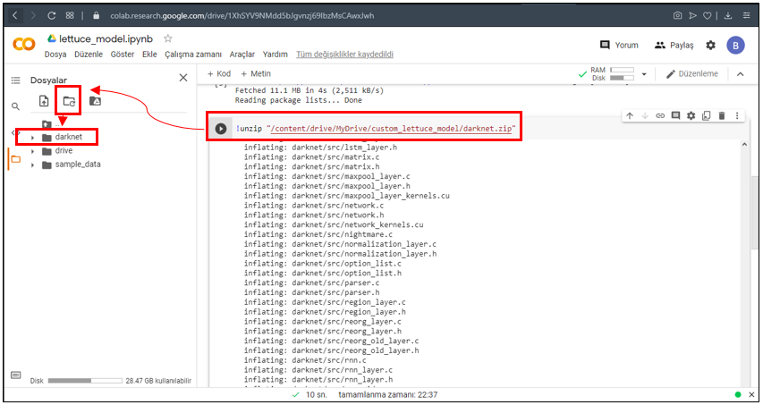

Aşağıdaki kod satırı ile darknet dosya yoluna gidelim.

    % cd /content/darknet

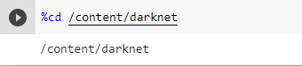

Kodların linux'un anlayabileceği hale getirmek için aşağıdaki kod satırını yazmamız gerekmektedir.

    !sudo apt install dos2unix

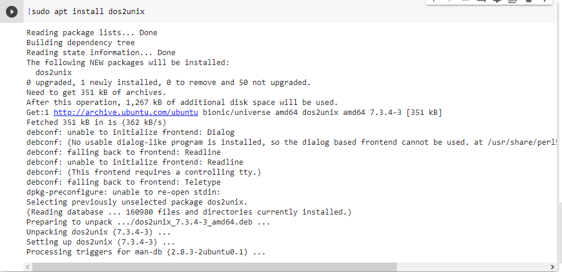

    !find . -type f -print0 | xargs -0 dos2unix

Zipten çıkarmış olduğumuz dosyayı linuxda kullanabilmek için bazı işznlerin verilmesi gerekmektedir. 
Bu izinler aşağıdaki kod satırı ile sağlanır.

    !chmod +x /content/darknet

Ardından zipten çıkarmış olduğumuz darknet dosyasını aşağıdaki, kod satırı ile yapılandıralım.

    !make

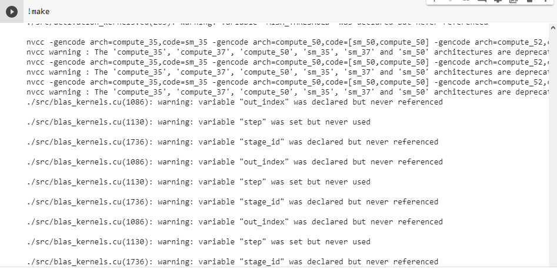

Yapılandırma tamamlandıktan sonra, çıktının son satırında aşağıdaki gibi sonuç çıktıysa başarılı
bir yapılandırma gerçekleşmiş demektir.

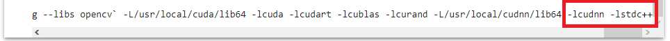

Aşağıdaki kod satırları ile darknet test edilir.

    !./darknet detector test cfg/coco.data cfg/yolov4.cfg yolov4.weights data/dog.jpg

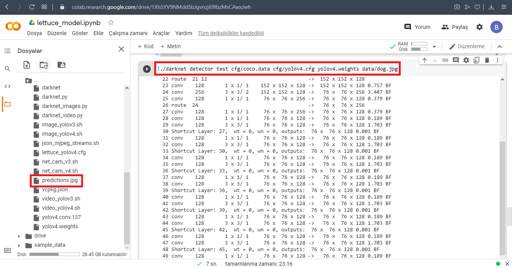

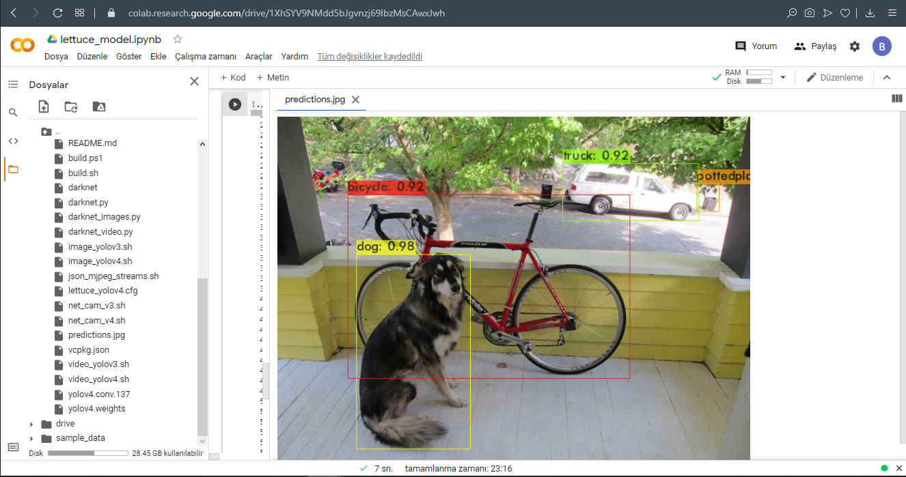

Darknet dosyası içerisinde varsayılan olarak bir backup dosyası bulunmaktadır. Bu dosyayı kaldırarak 
kendi oluşturduğumuz backup dosyasını buraya ekleyeceğiz.

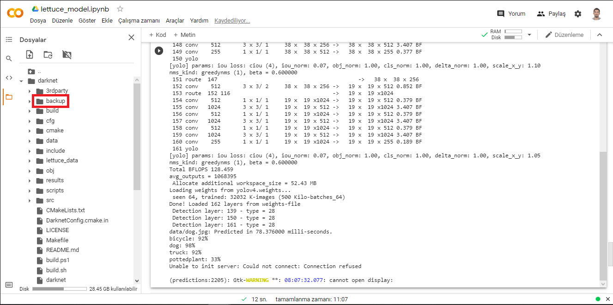

Backup dosyasını kaldırmadan önce Drive’mıza lettuce_weights isminde bir dosya oluşturalım. Bu dosya 
içerisine de backup isminde yeni bir dosya daha oluşturalım. Eğittiğimiz modelin ağırlıkları bu 
dosya içerisinde saklanacaktır. 

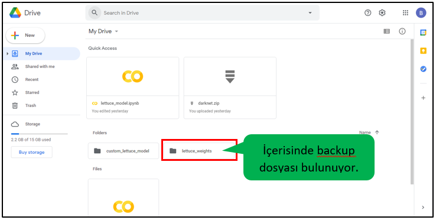

Aşağıdaki kod satırı ile mevcut backup dosyası kaldırılır.

    !rm /content/darknet/backup -r 

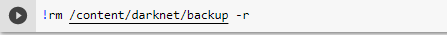

Ardından kendi oluşturmuş olduğumuz backup dosyası ile darknet dosyası birbirine bağlanır. Eğitim 
sonucunda oluşan ağırlıklar bu sayede oluşturmuş olduğumuz backup dosyasına atılır.

    !ln -s /content/drive/"My Drive"/lettuce_weights/backup /content/darknet

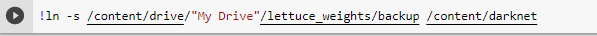

Tüm bu işlemler tamamlandıktan sonra artık eğitim işlemine başlayabiliriz. Eğitim işlemi 
için aşağıdaki kod satırı kullanılacaktır.

    !./darknet detector train lettuce_data/lettuce.data lettuce_yolov4.cfg yolov4.conv.137 -map -dont_show

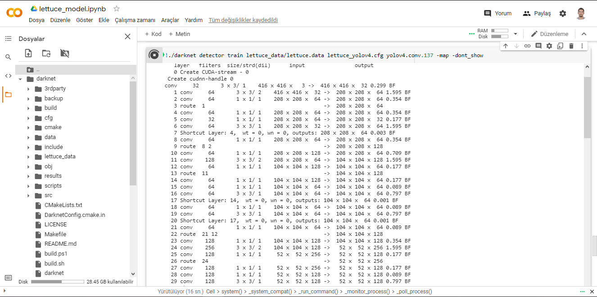

Eğitim işlemi 5-6 saat sürebilir. Sabırla bekleyiniz.

Eğitim işlemi bittikten sonra backup dosyası içerisine ağırlık dosyalarımızı gelecektir. lettuce_weights 
dosyasını bilgisayarımıza indirelim. Önceden oluşturmuş olduğumuz LettuceDetection klasörü içerisine 
lettuce_model isminde bir dosya oluşturalım ve bu dosya içerisine indirmiş olduğumuz ağırlıkları atalım. 
Bu ağırlıklar arasında sadece lettuce_yolov4_last.weights dosyasını kullanacağız. O yüzden diğer dosyaları 
silebiliriz. Ayrıca bu dosya içerisine önceden düzenlemiş olduğumuz lettuce_yolov4.cfg dosyasını da 
yükleyeceğiz. Bu dosyaya darknet klasörü içerisinden erişilebilir.

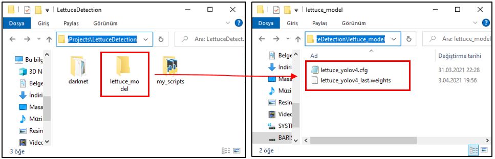

Test için kullanacağımız resim ve videoları tutmak için input_frame isminde bir klasör oluşturalım. 
Test sonucunda oluşan tespit işlemlerini kaydetmek için de output_frame isminde bir klasör oluşturalım. 
Gerekli dosyalar oluşturulduktan sonra LettuceDetection klasörünün içerisi aşağıdaki gibi olacaktır.

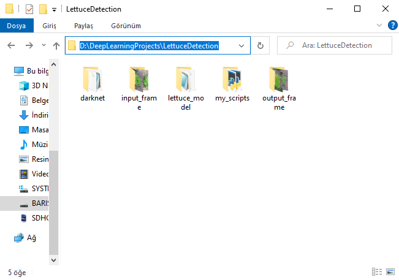

### ADIM-6: Eğitilen Modelin Test Edilmesi

Eğitilen model üzerinde gerekli testleri yapmak için my_scripts klasörü içerisine goruntu_test_etme.py 
ismide bir python dosyası oluşturalım ve aşağıdaki kodları yazmaya başlayalım.
    
    # Gerekli kütüphanelerin eklenmesi:
    import cv2
    import numpy as np
    
    # Test edilecek görüntünün okunması:
    image = cv2.imread("D:/DeepLearningProjects/LettuceDetection/input_frame/input_lettuce1.jpg")
    
    # Test edilecek görüntünün yüksekliğinin ve genişliğinin bulunması:
    img_width = image.shape[1]
    img_height = image.shape[0]

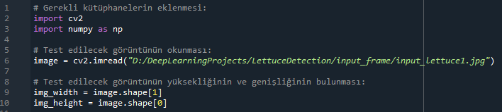

2 numaralı satırda görüntü işleme ve bilgisayarlı görü kütüphanesi olan OpenCV; 3 numaralı satırda matris 
işlemlerinin kolay bir şekilde yapılabildiği Numpy kütüphanesi içe aktarılır.

6 numaralı satırda test edilecek görüntünün okunması işlemi gerçekleştirilir. Bu görüntü sayısal bir şekilde 
image değişkeni içerisine atılır.

9 ve 10 numaralı satırlarda test edeceğimiz görüntünün genişlik ve yükseklik değerleri gerekli değişkenlere atılır.

    # Sayısal görüntünün blob formatına dönüştürülmesi:
    img_blob = cv2.dnn.blobFromImage(image, 1/255, (416,416), swapRB=True, crop=False)
    
    # Eğitilen modelde kullanılan sınıfların diziye atılması:
    labels = ["Marul"]
    
    # Testpit edilen görüntüde farklı sınıflar bulunuyorsa; herbir farklı 
    # sınıfı farklı renkte sınırlayıcı dikdörtgen içerisine alma:
    colors = ["0,255,255","0,0,255","255,0,0","255,255,0","0,255,0"]
    colors = [np.array(color.split(",")).astype("int") for color in colors]
    colors = np.array(colors)
    colors = np.tile(colors,(18,1))

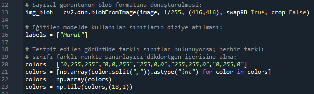

Sayısallaştırılmış görüntünün blob formata dönüştürülmesi gerekmektedir. 13 numaralı satırda sayısal 
görüntü blob formata dönüştürülmektedir. Blob, görünütünün 4 boyutlu tensörlere çevrilmiş halidir. 
Daha önceki yazılarımda tensör kavramına değinmiştim. Elimizde 8 bitlik bir görüntü bulunduğu için 
1/255 ile renk sayısı oranlanır. Eğitim setinde 416x416’lık görüntüleri kullandığımız için görüntünün 
boyutunu değiştiririz. swapRB, parametresi ile de görüntü RGB formattan BGR formata dönüştürülür. 

16 numaralı satırda, eğitim setinde kullandığımız sınıflar label dizisi içerisine atanır.

20 ve 23 numaralı satırlar arasında bulunan kodlar sayesinde testpit edilen görüntüde farklı sınıflar 
bulunuyorsa; her bir farklı sınıfı farklı renkte sınırlayıcı dikdörtgen içerisine alınır.

    # Eğitmiş olduğumuz modelin yüklenmesi:
    model = cv2.dnn.readNetFromDarknet("D:/DeepLearningProjects/LettuceDetection/lettuce_model/lettuce_yolov4.cfg",
                                "D:/DeepLearningProjects/LettuceDetection/lettuce_model/lettuce_yolov4_last.weights")
    
    # Bizi sadece çıktı katmanları ilgilendirdiği için çıktı katmanı seçilir. 
    # getUnconnectedOutLayers metodu çıktı katmanlarını bulur.
    layers = model.getLayerNames()
    output_layer = [layers[layer[0]-1] for layer in model.getUnconnectedOutLayers()]
    
    # Blob'a dönüştürmüş olduğumuz görüntü eğitilmiş modele input olarak verilir.
    model.setInput(img_blob)
    
    # Çıktı katmanı içerisindeki değerlere erişilir:
    detection_layers = model.forward(output_layer)
    
    # NON-MAXIMUM SUPPRESSION (OPERATION-1):
    ids_list = [] # predict id'leri tutar
    boxes_list = [] # bounding box özellikkerini tutar 
    confidences_list = [] # doğruluk (accuracy) değerlerini tutar
    # OPERATION-1'in bitişi

26 numaralı satırda Google Colab’da eğitmiş olduğumuz modelimiz yüklenir.

31 ve 32 numaralı satırlarda çıktı katmanı seçilir. Testimizi kontrol edebilmek için çıktı 
katmanında oluşan değerler bizim için önemlidir. 

35 numaralı satırda Blob’a dönüştürmüş olduğumuz görüntü eğitilmiş modele input olarak verilir.

38 numaralı satırda çıktı katmanındaki test için gerekli değerlere ulaşılır.

41, 42 ve 43 numaralı satırlardaki diziler ile NON-MAXIMUM SUPPRESSION yöntemi uygulanacaktır. 
NON-MAXIMUM SUPPRESSION yöntemi sayesinde en yüksek doğruluk oranına sahip nesne sınırlayıcı 
dikdörtgen ile sınırlandırılabilir. 

    # Çıktı katmanı değerlerinin tutulduğu dizi elemanları sırasıyla döndürülür:
    for detection_layer in detection_layers:
        
        for object_detection in detection_layer:
            
            # "object_detection" içerisindeki ilk 5 değer boundingBox ile ilgilidir.
            # 5'den sonraki değerler tahmin oranı ile ilgilidir.
            scores = object_detection[5:]
            
            # Tahmin oranları içerisindeki en büyük değer alınır. 
            predicted_id = np.argmax(scores)
            confidence = scores[predicted_id]
            
            # Belirlenen tahmin değerinden büyük değerlerin alınması:
            if confidence > 0.20:
                
                # Tespit edilen nesnelerin isimlerinin atandığı dizi:
                label = labels[predicted_id]
                
                # Tespit edilen nesnelerin sınır dikdörtgenlerinin bulunması:
                bounding_box = object_detection[0:4] * np.array([img_width,img_height,img_width,img_height])
                (box_center_x, box_center_y, box_width, box_height) = bounding_box.astype("int")
                start_x = int(box_center_x - (box_width/2))
                start_y = int(box_center_y - (box_height/2))
                
                # NON-MAXIMUM SUPPRESSION (OPERATION-2):
                ids_list.append(predicted_id)
                confidences_list.append(float(confidence))
                boxes_list.append([start_x, start_y, int(box_width), int(box_height)])
                # OPERATION-2'nin bitişi
                
                # Tespit işlemi burada bitti ve tespit edilen nesneler
                # NON-MAXIMUM SUPPRESSION dizileri içerisine kaydedildi. 

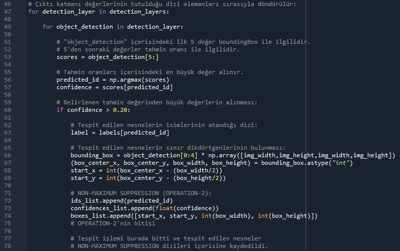

47 ve 49 numaralı satırlarda çıktı katmanı değerlerinin tutulduğu dizi elemanları sırasıyla döndürülür.

object_detection içerisindeki ilk 5 değer boundingBox (sınırlayıcı dikdörtgen) ile ilgilidir. Bu değerler 
53 numaralı satırda scores dizisi içerisine atanır. 5’den sonraki değerler tahmin oranı ile ilgilidir.

56 ve 57 numaralı satırlarda tahmin oranları içerisindeki en büyük değer alınır. 

63 numaralı satırda tespit edilen nesnelerin isimleri label dizisi içerisine atanır.

66 ve 69 numaralı satırlar arasında tespit edilen nesnelerin sınırlayıcı dikdörtgenleri bulunmaktadır.

72, 73 ve 74 numaralı satırlarda NON-MAXİMUM SUPPRESSION yönteminin ikinci adımı gerçekleştirilmiştir. 
Bu işlem de gerçekleştirildikten sonra tespit işlemi tamamlanır.

    # NON-MAXIMUM SUPPRESSION (OPERATION-3):
    # NMSBoxes methodu en yüksek güvenilirliğe sahip dikdörtgenlerin id'lerini döndürmektedir. 
    max_ids = cv2.dnn.NMSBoxes(boxes_list, confidences_list, 0.5, 0.4)
         
    for max_id in max_ids:
        
        max_class_id = max_id[0]
        box = boxes_list[max_class_id]
    
        start_x = box[0] 
        start_y = box[1] 
        box_width = box[2] 
        box_height = box[3] 
         
        predicted_id = ids_list[max_class_id]
        label = labels[predicted_id]
        confidence = confidences_list[max_class_id]
        # OPERATION-3'nin bitişi
                
        end_x = start_x + box_width
        end_y = start_y + box_height
                
        box_color = colors[predicted_id]
        box_color = [int(each) for each in box_color]
                     
        label = "{}: {:.2f}%".format(label, confidence*100)
        print("predicted object {}".format(label))
         
        cv2.rectangle(image, (start_x,start_y),(end_x,end_y),box_color,4)
        cv2.putText(image,label,(start_x,start_y-10), cv2.FONT_HERSHEY_SIMPLEX, 4, box_color, 4)

    cv2.imwrite("D:/DeepLearningProjects/LettuceDetection/output_frame/output_lettuce1.jpg", image)
    cv2.imshow("Detection", image)     
    cv2.waitKey(0)

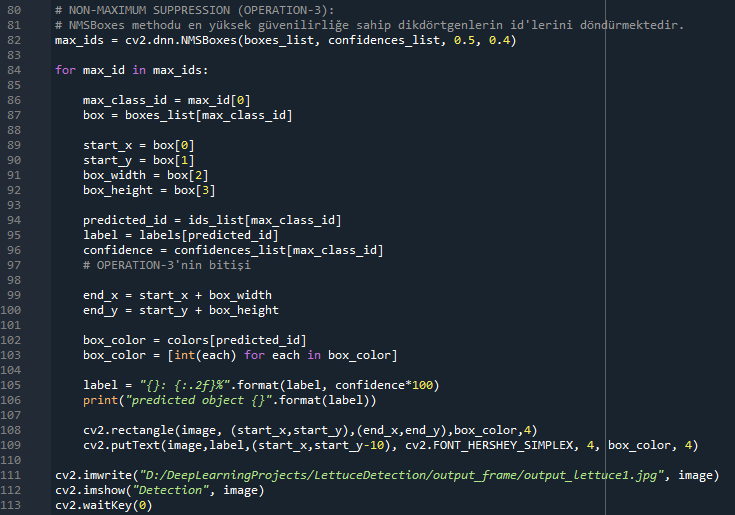

82 numaralı satırda kullanılan NMSBoxes methodu ile en yüksek güvenilirliğe sahip dikdörtgenlerin 
id’leri max_ids dizisi içerisine atanır.

84 numaralı satırda max_ids dizisi içerisindeki değerler döndürülür. 86 ve 92 numaralı satırlar 
arasında sınırlayıcı dikdörtgenin görüntü üzerindeki başlangıç, yükseklik ve genişlik değerleri 
start_x, start_y, box_width, box_height değişkenlerine atanır.

94, 95 ve 96 numaralı satırlar arasında tespit edilen nesnenin class ismi ve doğruluk oranı label 
ve confidence değişkenlerine atanır.

99 ve 100 numaralı satırlar arasında tespit edilen nesnenin sınırlayıcı dikdörtgeninin bitiş 
koordinatları bulunur.

102 ve 103 numaralı satırlar arasında tespit edilen nesneyi sınırlandıran dikdörtgenin rengi belirlenir.

NOT: Eğitmiş olduğumuz modeli bir video üzerinde test etmek istiyorsanız github hesabımdaki 
video_test_etme.py isimli python dosyasını indirebilirsiniz.
