## YOLO-DARKNET İLE MARUL TESPİTİ

Yolo algoritması kullanılarak nesne tespit işlemi gerçekleştirilecek. Tüm işlemler 
sırasıyla aşağıda adımlar halinde gösterilmiştir.

### ADIM-1: "Git Bash" Kurulumu

Git Bash sayesinde Github üzerinde bulunan klasörleri bilgisayarımıza indirebilmekteyiz.
Git Bash’i indirebilmek için aşağıda verilen adrese gidilir.

https://git-scm.com/downloads 

Bu adresteki sistem sizin bilgisayarınızda hangi işletim sistemi bulunduğunu otomatik olarak
algılayacaktır. Bilgisayarınızda bulunan işletim sistemine tıklanır ve indirme işlemine başlanır.

Setup dosyası bilgisayara indikten sonra tüm adımlara Next diyerek kurulum tamamlanır.

### ADIM-2: Darknet Kurulumu

Öncelikle çalışmalarımızı yapacağımız bir klasör oluşturmamız gerekiyor. Ben D’nin altına DeepLearningProjects
isminde bir klasör oluşturdum bu klasör içerisine de LettuceDetection isminde bir klasör daha oluşturdum. 
Tüm çalışmalarımızı ve darknet’i bu klasör içerisine kuracağım. Çalışmamda marul resimlerinin bulunduğu veri
setini kullanarak marul tespiti yapacağım için LettuceDetection ismini koydum. 

Daha sonra oluşturulan LettuceDetection klasörü içerisine girilir ve mause ile sağ tıklanarak “Git Bash Here”
seçeneği seçilir ve git komut satırı açılır.

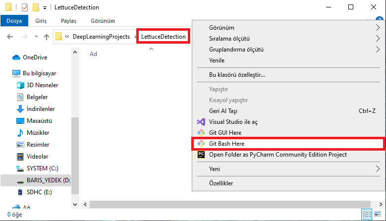

Ardından aşağıdaki şekilde gösterilen Git Bash açılır.

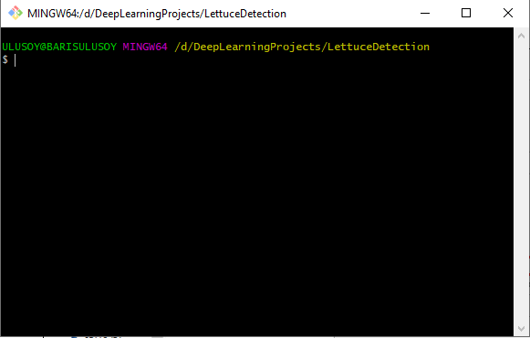

Git Bash açıldıktan sonra Darknet klasörlerinin bulunduğu github hesabına gitmek için aşağıdaki github adresine
gidilir. 

https://github.com/AlexeyAB/darknet 

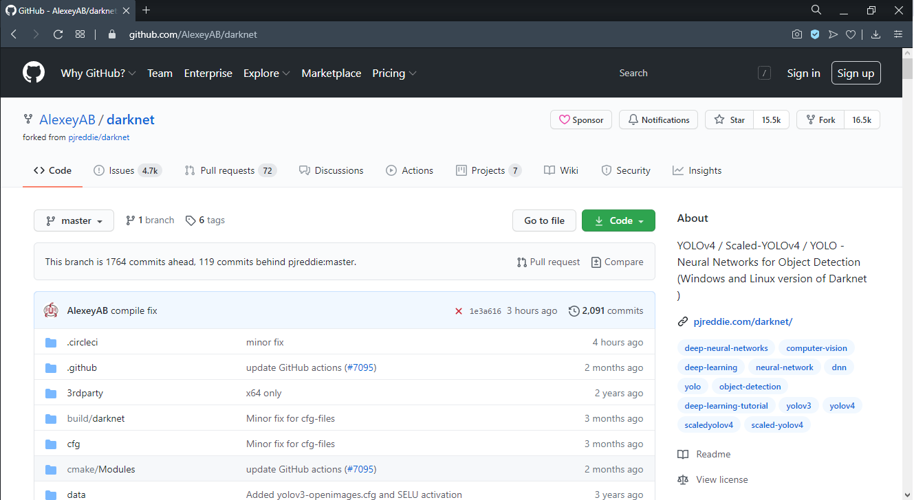

Bu adreste yolov4 modelini eğitebilmemiz için gerekli dosyalar bulunmaktadır. Bu github adresi kopyalanır ve Git Bash’e
geri dönülür. Aşağıdaki kod satırı Git Bash üzerine yazılır:

=> git clone https://github.com/AlexeyAB/darknet 

Ardından Darknet, LettuceDetection klasörümüzün içerisine yüklenmiş olur. 

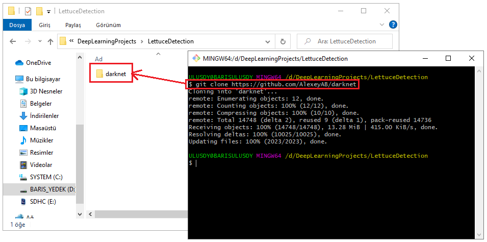

İndirilen darknet dosyasının içerisine girilir ve içerisinde bulunan Makefile dosyası Notepad ile açılır.
Daha sonra bu dosya içerisindeki bazı parametreler aşağıdaki şekilde gösterildiği gibi değiştirilir. 

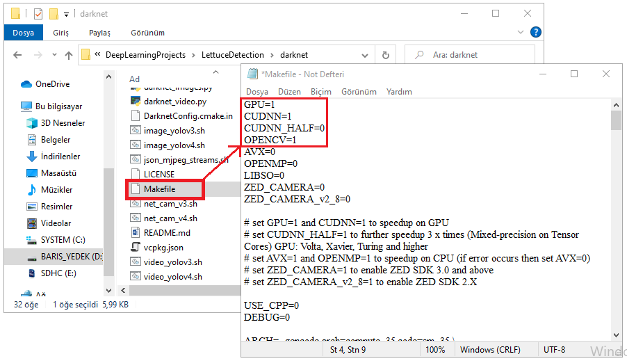

Ardından darknet github hesabının olduğu siteye yeniden gidilir. İlk olarak yolov4.conv.137 dosyası bilgisayarımıza
indirilir. Ctrl+F kullanılarak bu dosya bulunabilir.

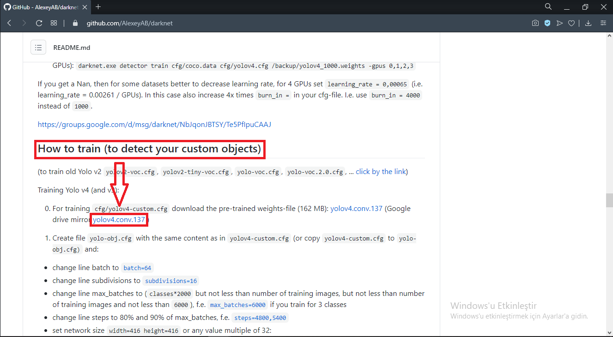

İkinci olarak yine bu adreste bulunan yolov4.weights dosyası bilgisayarımıza indirilir.

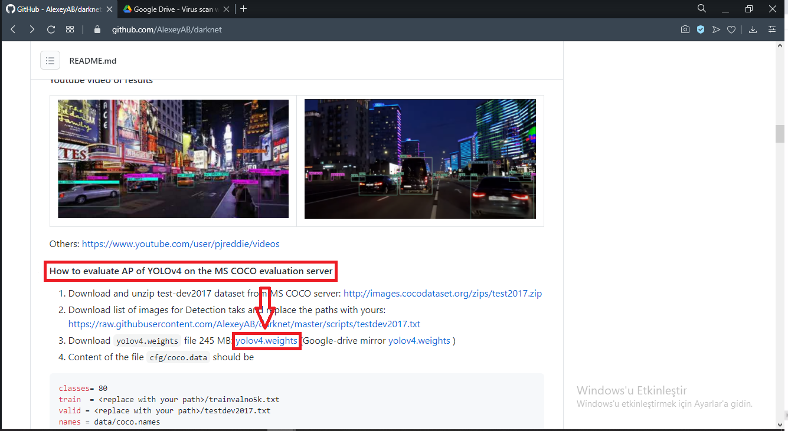

Daha sonra indirilen bu iki dosya darknet içerisine kaydedilir.

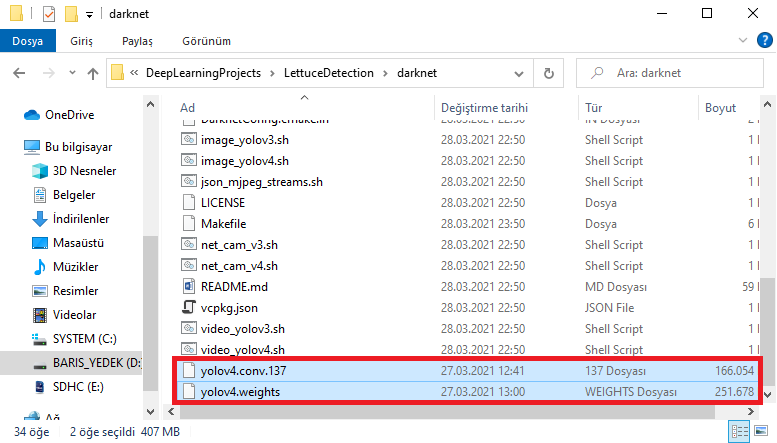

Darknet klasörü içerisinde bulunan cfg dosyası açılır. Bu dosya içerisindeki yolov4.cfg dosyası kopyalanır
ve darknet klasörü içerisine yapıştırılır. Bu klasörün ismi lettuce_yolov4.cfg olarak değiştirilir.

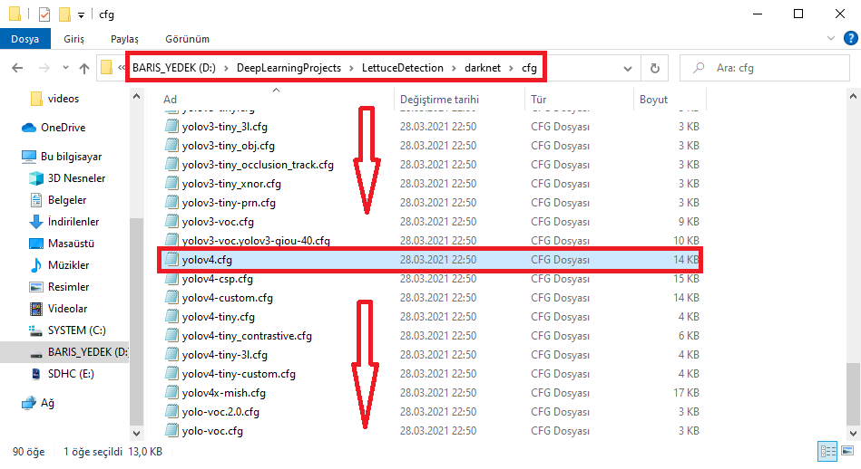

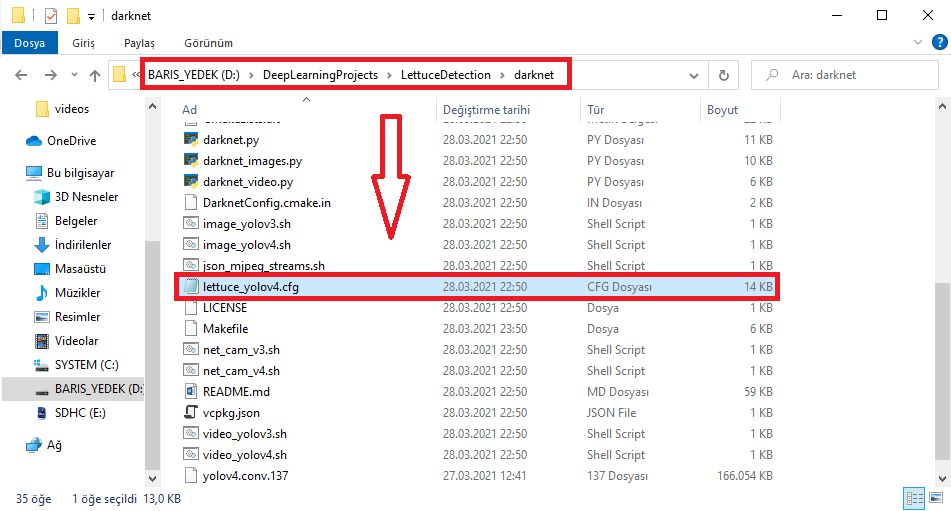

Daha sonra lettuce_yolov4.cfg dosyası not defteri ile açılır ve aşağıdaki değişiklikler yapılır:

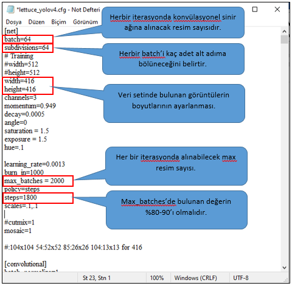

Yukarıdaki değişiklikler yapıldıktan sonra Ctrl+F yaparak arama bölümü açılır. “class” kelimesi aratılır.
Cfg dosyası içerisindeki tüm class parametrelerinin değiştirilmesi gerekmektedir. Veri setinde kaç adet 
sınıf varsa bu değer class parametresine yazılır. Bizim modelimizde sadece marul resimleri olduğu için class 
parametremize 1 değeri atanacaktır. Ayrıca filters parametresi de class değerinin 5 fazlasının 3 katı olması 
gerekmektedir (filters = (class+5)*3).

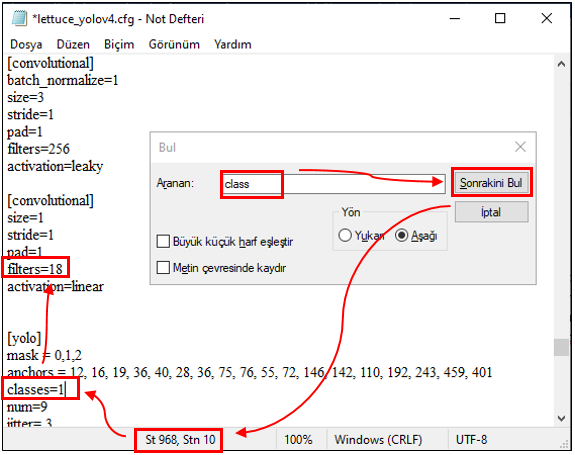

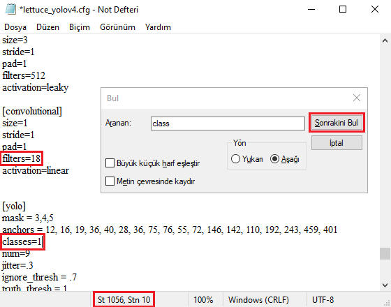

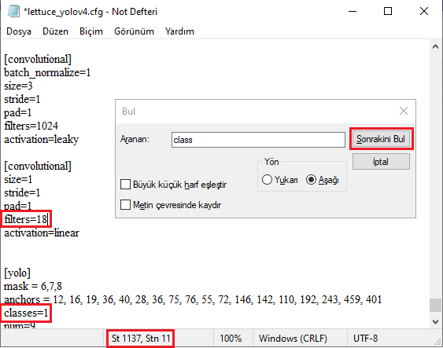

### ADIM-3: Veri Setini Oluşturma

İlk olarak veri setinde bulunacak resimleri saklayacağımız dosyayı oluşturalım. Dosyayı LettuceDetection 
klasörü içerisinde lettuce_images isminde oluşturacağız.

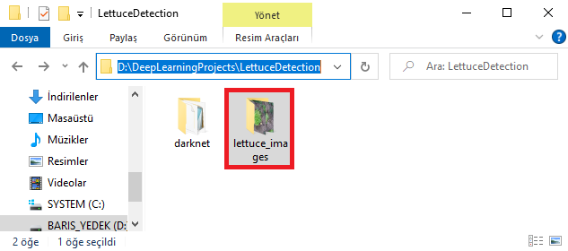

Artık veri setimiz için resimleri toplamaya başlayacağız. Veri setinde bulunacak resimlerin 416x416
boyutundan fazla olmasına dikkat ediniz.

Veri setiniz için yeterli sayıda resim bulamıyorsanız aşağıda göstermiş olduğum kod satırları ile veri
setinizde bulunan resimleri arttırabilirsiniz. Bu yüzden Google Colab’ı açalım ve ilk olarak aşağıdaki 
kod satırlarını kullanarak drive ile bağlantıyı gerçekleştirelim.

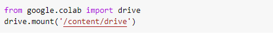

Veri setini arttırmak için keras kütüphanesinde bulunan sınıfları ve metotları kullanacağız.

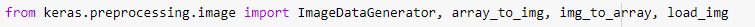

Veri arttırma yönteminin ve hiperparametrelerin seçimi aşağıdaki kod satırında gösterilmiştir.

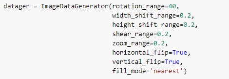

Veri arttırma işleminin yapılacağı görüntünün dosya okunması işlemi aşağıdaki kod satırlarında 
gösterimiştir.

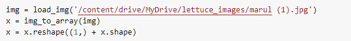

Okuduğumuz resimden kaç adet darklı resim oluşturmak istiyorsak bunu for döngüsünde belirtmemiz gerekir.
Bu işlem aşağıdaki kod satırlarında gösterilmiştir. 

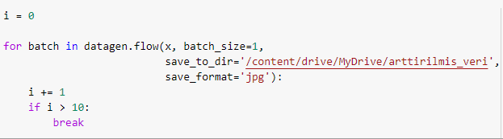

Veri setimiz içerisinde toplam 400 adet görüntü olacaktır. Aynı görüntülerin veri setinde bulunmamasına 
dikkat ediniz. Veri seti oluşturulduktan sonra Ctrl+A tuşu ile tüm resmiler seçilir ve resimlerden bir 
tanesine yeniden adlandır seçeneği seçilir. Böylece tüm resimlerin isimleri aynı şekilde olacaktır. 
Fakat rakamlar parantez içerisinde ve boşluklu olacaktır. Bu hata oluşturur, bu yüzden aşağıdaki kod 
satırları ile resimlerin isimleri düzenlenir. Bu kod satırları ile tek tek resimlerin elle düzeltmek 
yerine hızlıca istediğimiz isimle değiştirebiliriz.

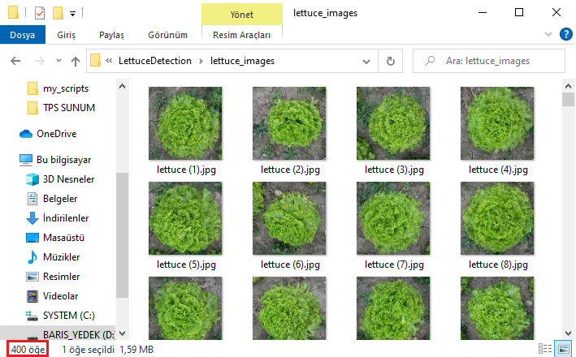

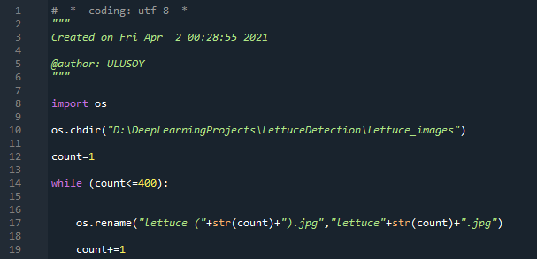

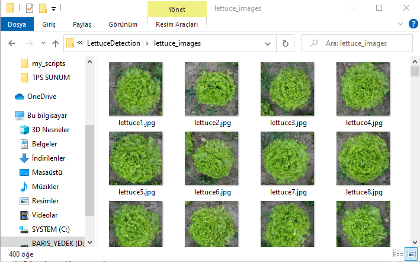

### ADIM-4: Veri Setindeki Resimleri Etiketleme

Resimleri etiketlemek için Make Sense’i kullanacağız. Bu site açık kaynaktır ve tamamen ücretsizdir. 
Etiketlenen resimleri yolo formatında indirme imkanımız da bulunmaktadır. Bu siteye aşağıdaki linkten
ulaşabilirsiniz.

https://www.makesense.ai 

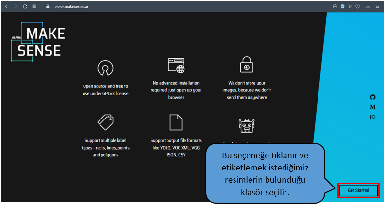

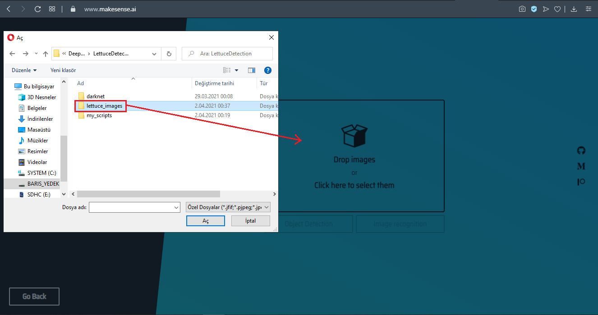

lettuce_images dosyası içerisindeki tüm resimler seçilir ve hepsi yüklenir.

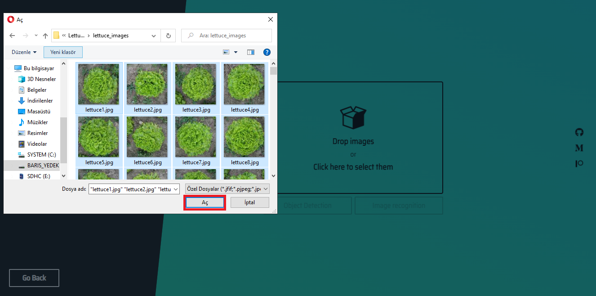

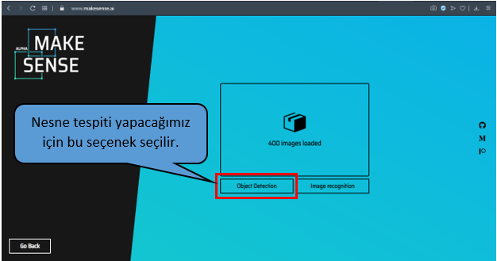

Çıkan imleç ile tespit etmek istediğimiz nesnenin sınırları çizilir. Ardından "Select label" seçeneğine
tıklanır.

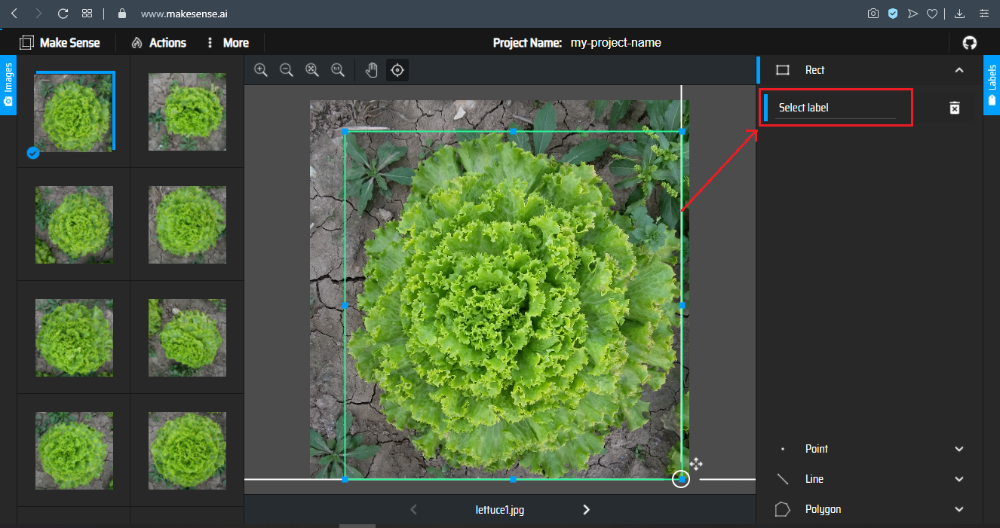

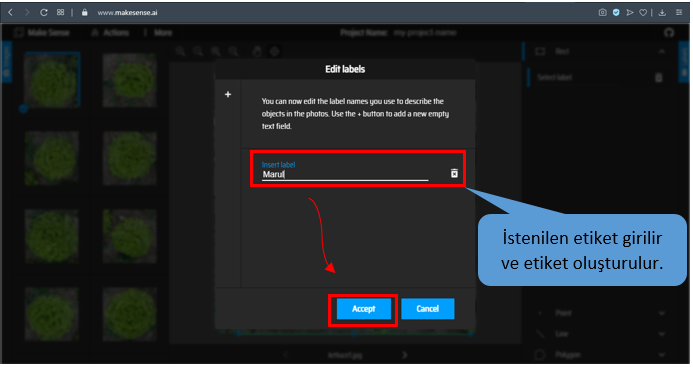

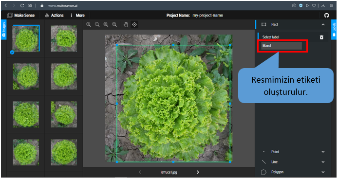

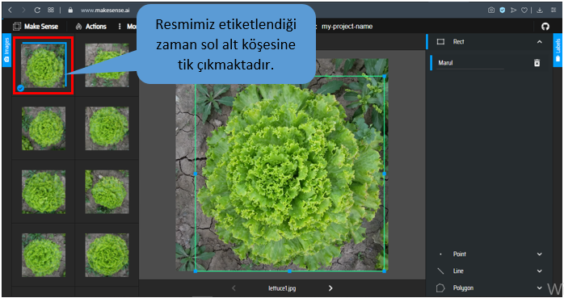

Veri setimizde bulunan tüm resimler yukarıdaki işlemlerden geçirilir. Tüm resimlerin doğru bir şekilde etiketlendiğinden emin olunuz.

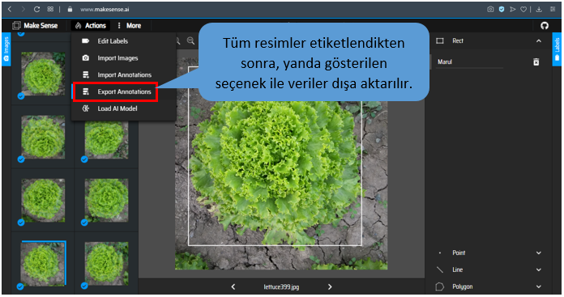

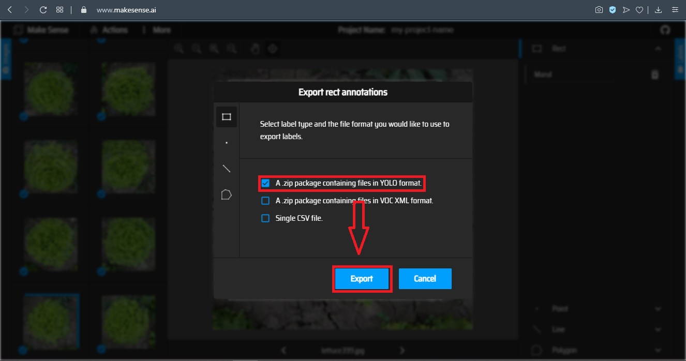

Export seçeneğine tıklandıktan sonra .zip uzantılı klasör bilgisayarımıza indirilir. Daha sonra bu zip dosya
içerisinde bulunan txt dosyaları, veri setimizin bulunduğu lettuce_images dosyasına atılır.

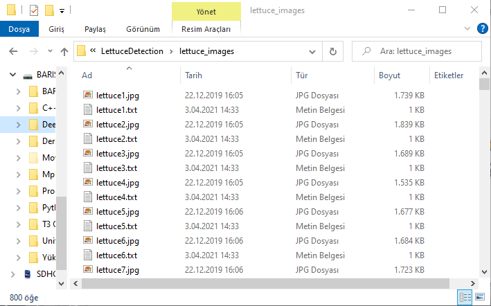

Bu txt dosyalarının içerisinde tespit etmek istediğimiz marulların verilerini tutmaktadır.

### ADIM-5: Eğitim ve Test Verilerinin Oluşturulması

Öncelikle veri setimizin ve gerekli dosyaların atılacağı lettuce_data dosyasını LettuceDetection
klasörü içerisine oluşturalım. Ardından oluşturulan dosya içerisine veri setimizin bulunduğu
lettuce_images dosyasını atalım.

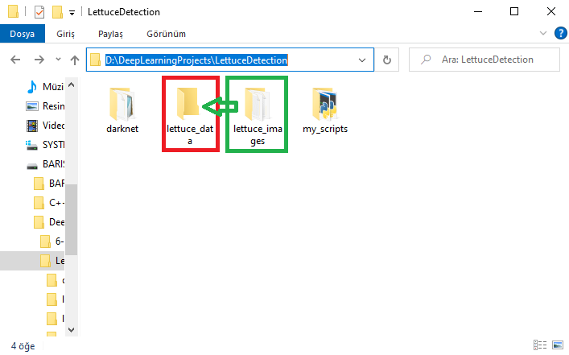

Not: Genel olarak sinir ağlarında verilerin %80’i eğitim, %20’si test için kullanılmaktadır.

lettuce_data dosyası içerisine lettuce_training.txt ve lettuce_testing.txt dosyalarını oluşturalım.

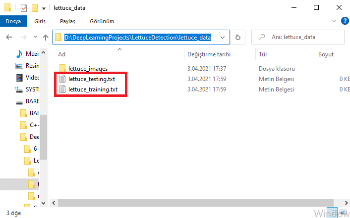

Oluşturulan bu txt dosyaları içerisine veri setinde bulunan resimlerin yolları girilecektir. lettuce_training.txt
dosyasına 320 adet resim yolu, lettuce_testing.txt dosyasına 80 adet resim yolu girilecektir. Bu işlemleri kolayca
yapmak için aşağıdaki kod satırlarını kullanabilirsiniz. 

    import os
    direction= os.getcwd()
    file_test=open("lettuce_testing.txt","a+",encoding="utf-8")
    file_train=open("lettuce_training.txt","a+",encoding="utf-8")
    count=1
    while (count<=320):
        file_train.write(r"lettuce_data\lettuce_image\lettuce{}.jpg".format(count)+"\n")
        count+=1
        if count==321:
            while (count<=400):
                 file_test.write(r"lettuce_data\lettuce_image\lettuce{}.jpg".format(count)+"\n")
                 count+=1

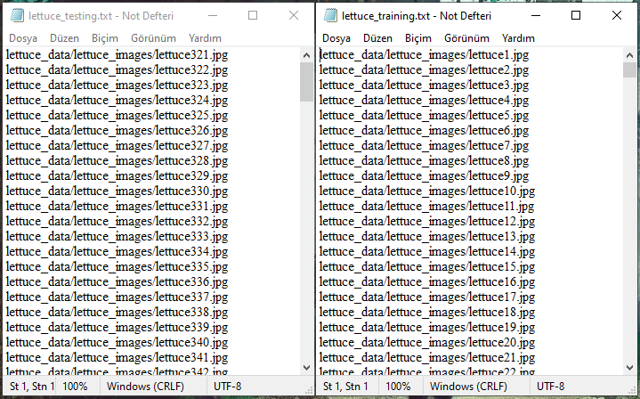

lettuce_data klasörü içerisine iki adet daha dosya oluşturulacaktır. İlk dosyanın ismi lettuce.names 
olacaktır ve bu dosya class ismini barındıracaktır. İkinci dosyanın ismi lettuce.data olacaktır ve bu 
dosya içerisinde modelimiz ile ilgili bilgiler tutulacaktır. Dosyaların isimlerini kaydetmeden önce 
txt dosyası açınız. Daha sonra dosya içeriğini düzenleyip dosya ismini kaydediniz.

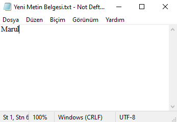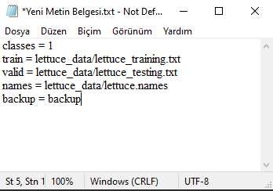

Son olarak lettuce_data klasörümüz aşağıdaki gibi olacaktır.

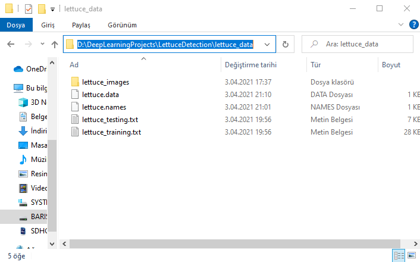

Ardından bu lettuce_data klasörünü darknet klasörümüz içerisine atalım.

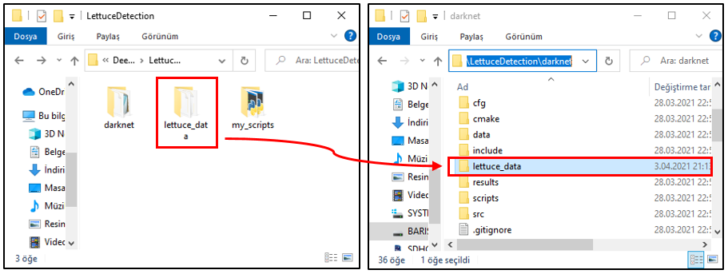

Son olarak lettuce_data klasörümüzün içerisine lettuce_labels isminde bir dosya oluşturalım. 
Bu dosya içerisine de etiketleme sonucu oluşan txt dosyalarımızı yükleyelim.

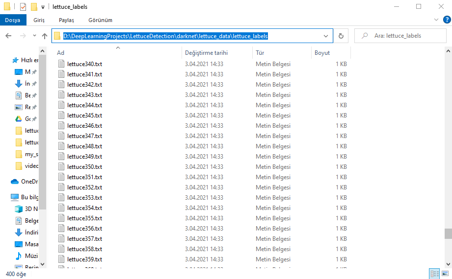

### ADIM-6: Google Colab Üzerinde Eğitim İşleminin Gerçekleştirilmesi

Darknet dosyamızı sıkıştırarak .zip formatına dönüştürelim. Daha sonra da bu dosyamızı 
Drive'mıza ekleyelim.

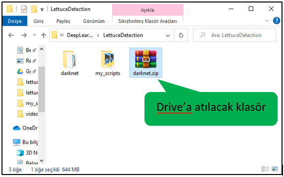

Drive’mızda yeni bir colab projesi oluşturalım. Colab projesinin nasıl oluşturulacağını daha önceki
yazılarımda anlatmıştım. Colab dosyamızın ismi lettuce_model.ipynb olarak değiştirelim. Drive’mıza 
custom_lettuce_model isminde bir klasör oluşturalım ve zip dosyamızı bu klasör içerisine atalım. 
Ardından çalışma zamanından GPU’yu seçerek, bağlantı kurma işlemini tamamlayalım.

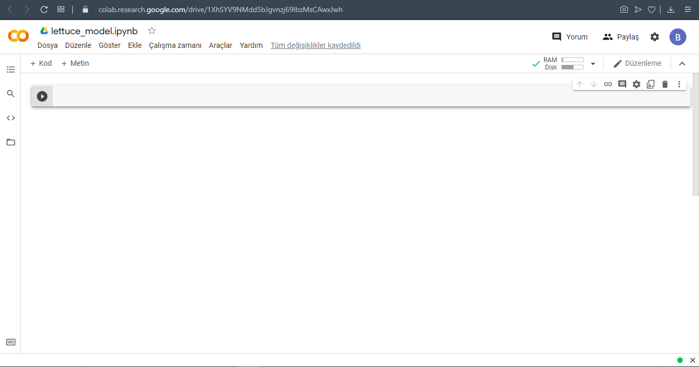

Aşağıdaki kod satırları yazılarak Drive ile bağlantı kurulur. 

    from google.colab import drive
    drive.mount('/content/drive')

Drive ile bağlantı kurulduğu sol taraftaki bölmeden kontrol edilebilir.

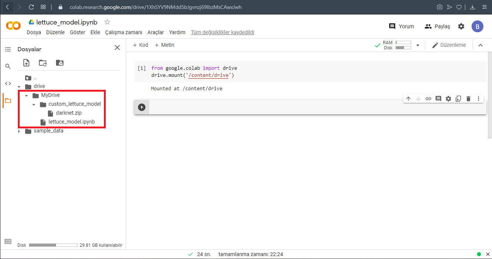

Sırasıyla aşağıdaki kod satırları yazılarak ubuntu güncellemeleri gerçekleştirilir.

    %cat /etc/lsb-release

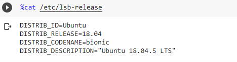

    !apt-get update

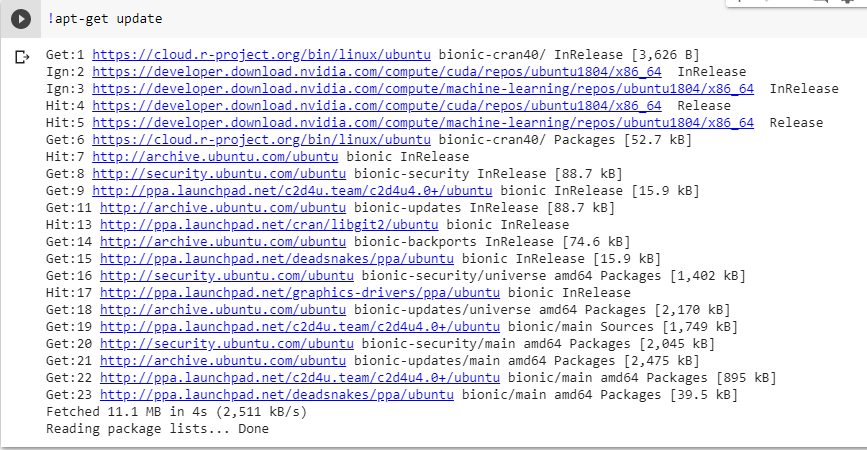

Aşağıdaki kod satırları ile ziplenmiş dosyalarımız çıkartılır. 

# 19. sayfada kaldım.

